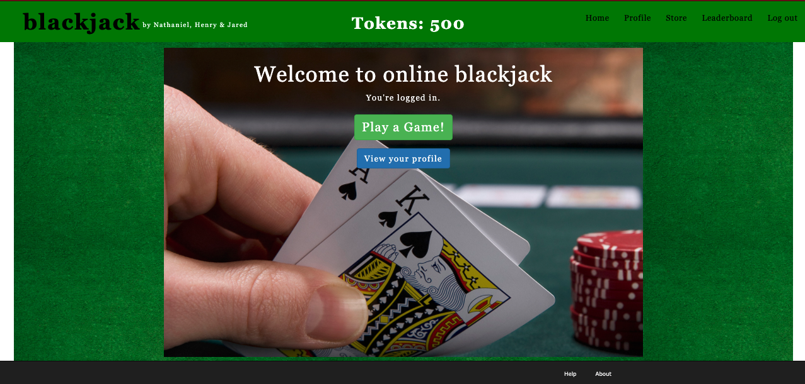

## Welcome to Team 9's Project Pages

### Our Team

- Nathaniel Wilnai - nathanielw@brandeis.edu
- Henry Arvans - harvans5@brandeis.edu
- Jared Panson - jaredpanson@brandeis.edu

### Our Product

Introducing blackjack online! Blackjack enthusiasts and newbies alike can compete against the dealer in order to improve their blackjack game, and even win piles of tokens in the process. If you’re really good, you may even find your way to the top of our leaderboard!

### Functionality

- Users can sign up, sign in and sign out of their accounts. 
- When users sign up, they get 500 tokens. 
- Once logged in, users can play a game of blackjack against the computerized dealer. 
- Within each game of blackjack, users can choose an amount of tokens to bet (from 10 to their total # of tokens) and then users can decide to either ‘hit’ or ‘stand’ depending on the cards that they have received, as well as the dealer's single showing card. 
- Users can also access their profile page, which contains their email, the number of tokens they have accumulated, and an option to update their sign-up information. 
- If a user runs out of tokens, they can visit our store to restock! In our store, we gift 100 tokens to any user with less than 100 tokens. 
- If a player begins a game with an insufficient amount of tokens, a link to the store will appear on the betting page. 
- Users can also visit the leaderboard page which shows all users, and their rank by total amount of tokens. 
- If users are new to blackjack, they can view the rules of blackjack in our about page, as well as learn some strategies for becoming the ultimate blackjack guru! 
- If users encounter any problems, they can visit the help page, where they can use our mail form to easily shoot us an email!

### Schema

Users: Our user table remembers important information about the user, both regarding their login information as well as game-related information. Such game-related information includes wins, token amounts, bet amounts, etc. 

Games: Our games table remembers the deck_id assigned to it upon creation. This deck_id is a unique id provided by the Deck of Cards API that allows us to retrieve information about the state of the cards at any time. It also has a is_game_done column, which ensures that once a game is done, users cannot receive extra rewards or penalties.

Game_sessions: The join table between users and games. 

### Technologies

- Heroku Link for deployed app: https://gentle-stream-27906.herokuapp.com/ (url)
- Github repo: https://github.com/Nwilnai/Team9 (url)
- Trello Link: https://trello.com/b/fLieZouT/capstone-team-9
- Deck of Cards API: https://deckofcardsapi.com/
- Mail_form: https://github.com/heartcombo/mail_form 
- Faker: https://github.com/faker-ruby/faker
- Github Pages
- Github Actions (Workflow for CI)
- New Languages (HTML, CSS, SCSS, JS)
- VSCode

### Interesting Engineering

- Mail_form: https://github.com/heartcombo/mail_form - The mail form gem creates a simple form which our users can use to ask us questions and give us feedback about our site, without having to actually email us themselves.
We utilized the gem by installing it and writing “require ‘mail_form’” in the controller. We also created a scaffold for contact and within the controller for contact for def create we were able to use mail_forms main feature (deliver). This was done with @contact.deliver which then attempts to send the email from the form. Lastly we needed to include a delivery method using SMTP in both the development and production files which works well with gmail allowing us to create a gmail account for our application and putting its port, domain, account name and password in the file. This then allows the emails to be sent when contact.deliver is called.

- Deck of Cards API: https://deckofcardsapi.com/ - This API allows for the creation of decks, each of which can be split into piles. The API saves the state of each deck (and pile), allowing us to use it to represent every player's hand. We have a new deck assigned to each game, from which all the cards are drawn. This has its upsides and downsides. On the upside, we didn't have to create cards and save their state. On the downside, however, our website takes a bit longer to respond due to the API requests going on in the background, and the request fails once in a while. However, one of our primary goals in doing this project was learning how to use an API, and this API served that purpose well.

- Leaderboard: We included a leaderboard to create competition amongst our users, and to give them a sense of how they rank amongst their peers.
To create this, we created a new leaderboard controller and a private method inside of it called rank_users(). This method iterates through all users with tokens and adds them to a list variable @ranks. Once done iterating, the list of users are then sorted by token amount, just as they are displayed in a traditional leaderboard.
For our frontend, we simply return a call to this private method in the controller index method, so our views index page can use it. 


### Methodologies

- Development: We had team members focus on areas of developement that interested them. Nathaniel worked mostly with the back-end, Jared primarily worked with the front-end, and Henry explored both areas. This style of developement was very successful, as all of us were interested in the individual work that we were doing, and we also covered all of our bases without overly relying on any one person. We also used seperate branches, both locally and remotely, while working on this project. Once changes were ready, we made pull requests, and made sure to look over the incoming changes as a team (or if circumstances didn't allow, we'd have at least one other person look over the changes). 
As far as work allocation was concerned, we trusted everyone to have a good idea of how much time they could contribute. As such, we used trello for keeping track of tasks, and at the beginning of each week, we individually chose which tasks we wanted to take on. We checked in multiple times a week to update everyone on progress being made, as well as to plan the following week out.

- Deployment: We use heroku for deployment. We initially had heroku update as soon as our master branch was changed, but it now works with our continuous integration.

- Testing: As mentioned in the deployment section, we have CI set up to run our tests. The tests run on every push and pull request to our master branch.

- Results: We have a fully-functioning product that we are all very proud of, and we've all grown so much as developers over the course of this project! Our team members accomplished their goals for this semester (particularly Henry and Nathaniel, who really wanted to work with an API), and we all had a wonderful time working with each other, which is all we could've asked for!


### Architecture

A screenshot of our website:




# Default Text (To Be Deleted)

You can use the [editor on GitHub](https://github.com/Nwilnai/Team9/edit/gh-pages/index.md) to maintain and preview the content for your website in Markdown files.

Whenever you commit to this repository, GitHub Pages will run [Jekyll](https://jekyllrb.com/) to rebuild the pages in your site, from the content in your Markdown files.

### Markdown

Markdown is a lightweight and easy-to-use syntax for styling your writing. It includes conventions for

```markdown
Syntax highlighted code block

# Header 1
## Header 2
### Header 3

- Bulleted
- List

1. Numbered
2. List

**Bold** and _Italic_ and `Code` text

[Link](url) and 
```

For more details see [GitHub Flavored Markdown](https://guides.github.com/features/mastering-markdown/).
